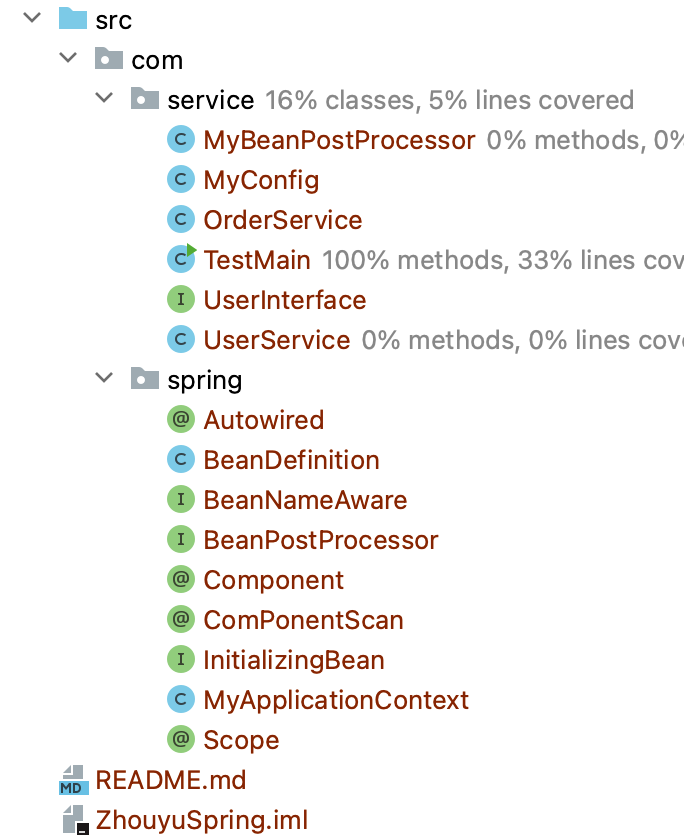

# MySpring
手写spring
这是一个通过javaJDK手写的一个spring

## 代码结构




## 主要类说明：

### `MyApplicationContext` 类

`MyApplicationContext` 类实现了一个简单的 Spring 容器。下面是该容器的创建步骤：

1. 创建 `MyApplicationContext` 类，传入一个 `configClass` 参数，表示配置类。

2. 在构造函数中，将传入的 `configClass` 赋值给 `configClass` 成员变量。

3. 如果 

   ```
   configClass
   ```

    上标注了 

   ```
   @ComponentScan
   ```

    注解，则进行扫描操作。

   - 通过反射获取 `@ComponentScan` 注解对象，并获取其 `value` 属性，即扫描路径。
   - 将路径中的 `.` 替换为 `/`，方便后续扫描操作。
   - 使用类加载器加载指定路径下的资源，并获取路径下的所有 `.class` 文件的绝对路径。
   - 遍历 `.class` 文件，根据文件路径获取包名和类名。
   - 如果类标注了 `@Component` 注解，则进行下一步操作。
   - 如果类实现了 `BeanPostProcessor` 接口，则实例化该类，并将其加入 `beanPostProcessorList` 列表。
   - 获取 `@Component` 注解的值，作为 bean 的名称。
   - 创建 `BeanDefinition` 对象，设置其 `scope` 属性。
   - 将 `beanDefinition` 加入 `beanDefinitionMap` 中。

4. 遍历 

   ```
   beanDefinitionMap
   ```

    中的所有 beanDefinition 对象。

   - 如果 bean 的 `scope` 为 singleton，则进行实例化操作。
   - 调用 `createBean` 方法创建 bean，并将其加入 `singletonObjects` 中。

5. 完成容器的创建，可以通过 `getBean` 方法获取 bean 实例。
